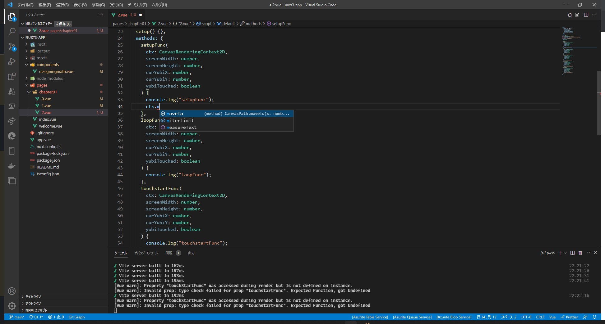

# このリポジトリについて

このファイル群は
Designing Math.
http://www.bnn.co.jp/books/11410/
のサンプルファイルから発祥しています。本を買ってから試してください。
Chapter?? フォルダがサンプルファイルです。

サンプルを元に
Nuxt3 https://v3.nuxtjs.org/
手習いもかねて DesigniningMath を移植しています。

関数に型指定がされていることによりコード補完の支援を得ることができます。



# Nuxt 3 Minimal Starter

We recommend to look at the [documentation](https://v3.nuxtjs.org).

## Setup

Make sure to install the dependencies

```bash
npm i
```

## Development

Start the development server on http://localhost:3000

```bash
npm run dev
```

## Production

Build the application for production:

```bash
npm run build
```

Checkout the [deployment documentation](https://v3.nuxtjs.org/docs/deployment).
